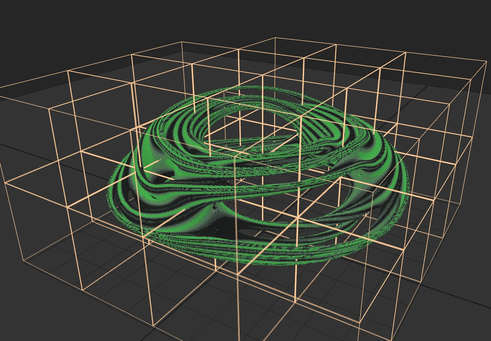

# MagicaVoxel File Writer for Rust

my conversion to Rust of my original c++ [MagicaVoxel File Writer](https://github.com/aiekick/MagicaVoxel_File_Writer)

vox.hm is the file format descriptor for HexaMonkey :
- original topic about it : https://github.com/ephtracy/voxel-model/issues/19
- HexaMonkey tool : http://hexamonkey.com/

### Sample code 1 :

```rust
mod vox_writer;

fn main() {
    let mut vox = vox_writer::VoxWriter::create_empty();

    for i in 0..1000 {
        for j in 0..1000 {
            let cube_pos =
                f64::floor(f64::sin((i * i + j * j) as f64 / 50000.0) * 150.0) + 150.0;
            let cube_color = (i + j) % 255 + 1;
            vox.add_voxel(i, j, cube_pos as i32, cube_color);
        }
    }

    vox.save_to_file("output_voxwriter.vox".to_string())
        .expect("Fail to save vox file");
}
```

you can generate that (previewed in [Magicavoxel](https://ephtracy.github.io/))


### Sample code 2 :

```rust
mod vox_writer;
fn main() {
    let mut vox = vox_writer::VoxWriter::create_empty();
    const SIZE:i32 = 1000;
    const ZOOM_XZ:f64 = 5.0;
    const ZOOM_Y:f64 = 5.0;
    const ITERATIONS:i32 = 5;
    fn mix(x:f64, y:f64, a:f64) -> f64 {
        x * (1.0 - a) + y * a
    }
    for i in 0..SIZE {
        let px = (i as f64 * 2.0 / SIZE as f64 - 1.0) * ZOOM_XZ;
        for k in 0..SIZE {
            let pz = (k as f64 * 2.0 / SIZE as f64 - 1.0) * ZOOM_XZ;
            let an = f64::atan2(px, pz);
            let cx = mix(0.2, -0.5, f64::sin(an * 2.0));
            let cy = mix(0.5, 0.0, f64::sin(an * 3.0));
            let path = f64::sqrt(px * px + pz * pz) - 3.0;
            for j in 0..SIZE {
                let mut rev_y = (j as f64 * 2.0 / SIZE as f64 - 1.0) * ZOOM_Y;
                let mut rev_x = path;
                let mut kk = 1.0;
                let mut hh = 1.0;
                for _idx in 0..ITERATIONS {
                    hh *= 4.0 * kk;
                    kk = rev_x * rev_x + rev_y * rev_y;
                    if kk > 4.0 { break; }
                    let tmp_x = rev_x;
                    rev_x = rev_x * rev_x - rev_y * rev_y + cx;
                    rev_y = 2.0 * tmp_x * rev_y + cy;
                }
                let df = f64::sqrt(kk / hh) * f64::log10(kk);
                if f64::abs(df) - 0.01 < 0.0 {
                    let cube_color = ((f64::sin(rev_x + rev_y) * 0.5 + 0.5) * 6.0) as i32 + 249;
                    vox.add_voxel(i, k, j, cube_color); // magicavoxel use the z as up axis
                }
            }
        }
    }
    vox.save_to_file("julia_revolute_voxwriter.vox".to_string())
        .expect("Fail to save vox file");
}
```

you can generate that (previewed in [Magicavoxel](https://ephtracy.github.io/))


